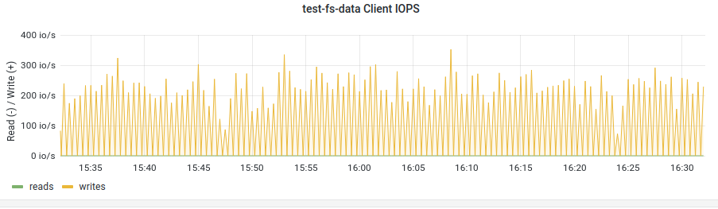
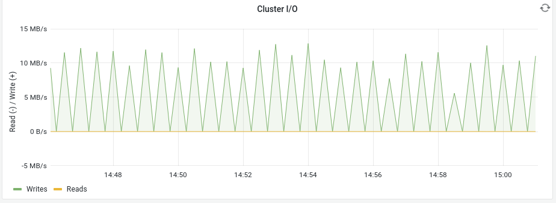
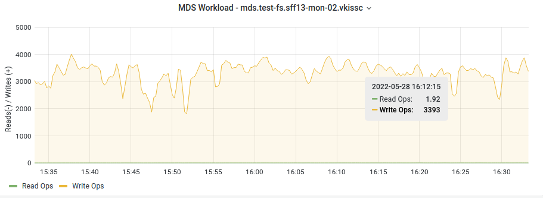

# Test 3
# ceph quincy - create dirs with script below

```bash
#!/usr/bin/python3
import subprocess
import hashlib
import re
import random

target_path = "./fs-test-1"
dir_create_numbers = 5000000

lst = ['Addis Ababa', 'Ahmedabad', 'Alexandria', 'Atlanta', 'Baghdad', 'Bangalore', 'Bangkok', 'Barcelona', 'Beijing', 'Belo Horizonte', 'Bogot', 'Buenos Aires', 'Cairo', 'Chengdu', 'Chennai', 'Chicago', 'Chongqing', 'Dalian', 'Dallas', 'Dar es Salaam', 'Delhi', 'Dhaka', 'Dongguan', 'Dubai', 'Foshan', 'Fukuoka', 'Guadalajara', 'Guangzhou', 'Hangzhou', 'Harbin', 'Ho Chi Minh City', 'Hong Kong', 'Houston', 'Hyderabad', 'Istanbul', 'Jakarta', 'Jinan', 'Johannesburg', 'Karachi', 'Khartoum', 'Kinshasa', 'Kolkata', 'Kuala Lumpur', 'Lagos', 'Lahore', 'Lima', 'London', 'Los Angeles', 'Luanda', 'Madrid', 'Manila', 'Mexico City', 'Miami', 'Moscow', 'Mumbai', 'Nagoya', 'Nairobi', 'Nanjing', 'New York City', 'Osaka', 'Paris', 'Philadelphia', 'Pune', 'Qingdao', 'Rio de Janeiro', 'Riyadh', 'Sao Paulo', 'Saint Petersburg', 'San Francisco', 'Santiago', 'Seoul', 'Shanghai', 'Shenyang', 'Shenzhen', 'Singapore', 'Surat', 'Suzhou', 'Taipei', 'Tehran', 'Tianjin', 'Tokyo', 'Toronto', 'Washington, D.C.', 'Wuhan', 'Xian', 'Yangon']
def random_string():
    return random.choice(lst)

def execute(command):
    process = subprocess.Popen(command, stdout=subprocess.PIPE, stderr=subprocess.PIPE, shell=True)
    output, _ = process.communicate()
    return output.decode("utf-8")

execute("rm -rf " + target_path)
execute("mkdir -p " + target_path)

# create many directories
for x in range(dir_create_numbers):
    hash = hashlib.md5(str(x).encode('utf-8'))
    parts = re.findall('...',hash.hexdigest())
    dir_path = "/".join(parts)
    full_dir_path = target_path + "/" + dir_path
    full_file_path = full_dir_path + "/file.txt"
    execute(" && ".join([
        "mkdir -p " + full_dir_path,
        "echo '" + random_string() + "' > " + full_file_path,
    ]))
    print("{i}\r".format(i=x))

```

## Resaults





