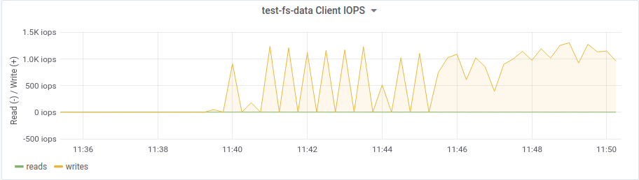
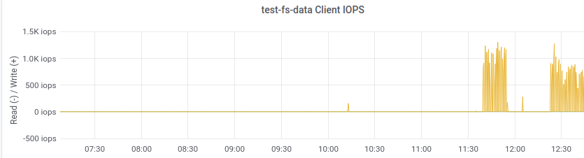

# step 4 - NOATIME - NODIRATIME
- setting these fs flags while mounting and see what happens

> TIP: **_netdev** The filesystem resides on a device that requires network access (used to prevent the system from attempting to mount these filesystems until the network has been enabled on the system).

# testing iops

## before
```bash
{ipaddress}:{port}:/ {mount}/{mountpoint} {filesystem-name}     [name=username,secret=secretkey|secretfile=/path/to/secretfile],[{mount.options}]
# example
10.0.21.111,10.0.21.118,10.0.21.117,10.0.21.113:/    /data-ceph    ceph    name=admin,secret=AQDn/FNi92d0MhAA+XwGMFPEAiG3WD7371kDag==,noatime,_netdev    0       2
# CMD example
$ sudo mount -t ceph 10.0.21.111,10.0.21.118,10.0.21.117,10.0.21.113:/ /data-ceph/ -o name=admin,secret=AQDn/FNi92d0MhAA+XwGMFPEAiG3WD7371kDag==
```
- after mounting like below using 5 instances writing 4 K files in directories for 5 minutes



## after

```bash
10.0.21.111,10.0.21.118,10.0.21.117,10.0.21.113:/    /data-ceph    ceph    name=admin,secret=AQDn/FNi92d0MhAA+XwGMFPEAiG3WD7371kDag==,noatime,nodiratime,_netdev    0       2
```

## resault
